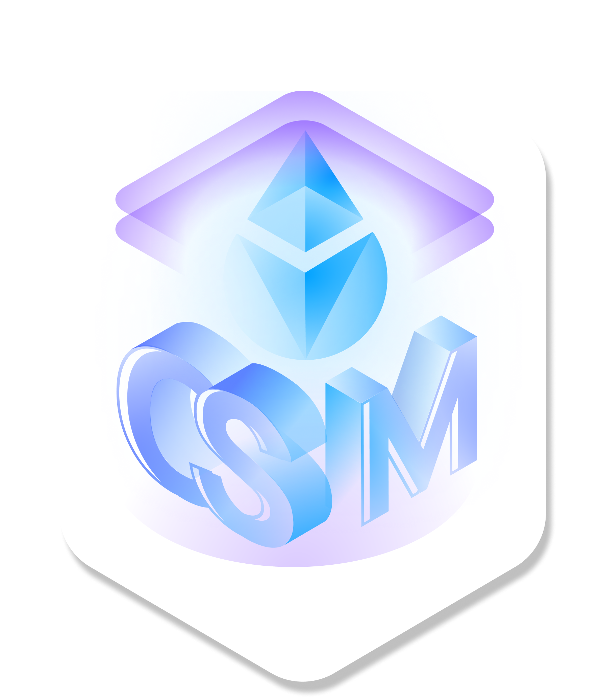

<p align="center">
  
</p>
<h1 align="center"> Lido Community Staking Module </h1>

### Getting Started

- Install [Foundry tools](https://book.getfoundry.sh/getting-started/installation)

- Install [Just](https://github.com/casey/just)

- Install project dependencies

```bash
just deps
```

- Config environment variables

```bash
cp .env.sample .env
```

Fill vars in the `.env` file with your own values

- Build and test contracts

```bash
just
```

### Features

- Run tests

```bash
just test-all # run all tests that possible to run without additional configurations
# or run specific tests
just test-unit
# deploy CSM to local fork and run integration tests over it
just test-local

# run integration tests with specific deployment config
# make sure that corresponding RPC_URL is set
DEPLOYMENT_CONFIG=./config/holesky-devnet-0/deploy-holesky-devnet.json just test-integration
```

- Make a gas report

```bash
just gas-report
```

- Install dependencies

Dependencies are managed using yarn. To install new dependencies, run:

```bash
yarn add <package-name>
```

- Deploy to local fork

```bash
just deploy-local
```

- Deploy to local fork of non-mainnet chain

```bash
CHAIN=holesky just deploy-local
```

### Notes

Whenever you install new libraries using yarn, make sure to update your
`remappings.txt`.
