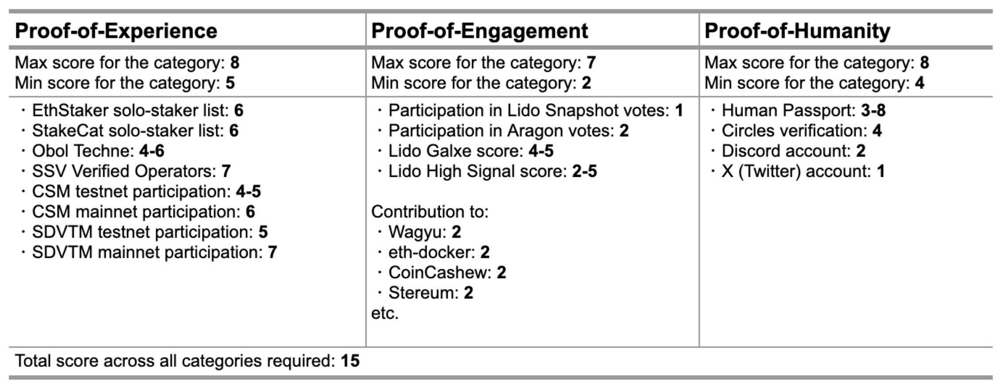

# ICS Assessment Scripts

Lightweight Python utilities for assessing ICS eligibility across three categories:
- Engagement (governance participation and community activity)
- Experience (solo-staking and validator/operator credentials)
- Humanity (sybil-resistance and social presence)

The root `main.py` orchestrates category scores and prints a summary for the provided addresses.

The methodology, scoring and the sources are described in the corresponding [Research Forum post](https://research.lido.fi/t/community-staking-module/5917/141).



## How Data Is Collected
- Static, curated snapshots (as-of a date or block):
  - Community lists (Experience): [EthStaker](https://github.com/ethstaker/solo-stakers) and [StakeCat](https://github.com/Stake-Cat/Solo-Stakers/tree/main) solo-staker CSVs are compiled from community sources and reflect membership as of the collection date.
  - SSV Verified operators (Experience) are collected on a specific date with exclusion of Pro operators.
  - SDVTM participants (Experience): a snapshot list, not expected to change.

- On-chain, block-stamped reports (as-of a block):
  - Aragon voters (Engagement): a compiled CSV of addresses and vote counts.
  - Obol Techne tiers (Experience): Base, Bronze and Silver NFT holders.
  - Circles group members (Humanity): a snapshot list of eligible addresses.
  - CSM Performance (Experience): performance logs are read from IPFS JSON reports for the last N months of data.

- Real-time queries (at run time):
  - Snapshot Voting (Engagement): votes strictly before a configured cutoff timestamp (see `SNAPSHOT_VOTE_TIMESTAMP` in code; UTC).
  - Galxe Loyalty (Engagement): live loyalty ranks pulled from the Lido Galxe space via GraphQL pagination at run time.
  - GitPOAP (Engagement): POAP holders fetched live for a curated set of events.
  - High Signal (Engagement): if `HIGH_SIGNAL_API_KEY` is set, activity scores are queried for a configured date range; otherwise the operator provides the score manually.
  - Gitcoin Passport (Humanity): if `HUMAN_PASSPORT_API_KEY` is set, the passport score is fetched live; otherwise the operator provides the score manually.

## Requirements
- Python 3.10+
- `requests` library
- `web3` (only for Engagement High Signal address checksum)

Install (example):
```bash
python -m venv venv && . venv/bin/activate
pip install -r requirements.txt
```

## Environment Variables (optional)
- `HIGH_SIGNAL_API_KEY` (Engagement): Enables automatic High Signal lookups; otherwise manual input is prompted.
- `HUMAN_PASSPORT_API_KEY` (Humanity): Enables automatic Gitcoin Passport score; otherwise manual input is prompted.

## Usage
Run any category or the orchestrator with one or more addresses:
```bash
# Orchestrator (runs all categories)
python artifacts/mainnet/ics/assessment/main.py 0xabc... 0xdef...

# Individual categories
python artifacts/mainnet/ics/assessment/engagement/main.py 0xabc... 0xdef...
python artifacts/mainnet/ics/assessment/experience/main.py 0xabc... 0xdef...
python artifacts/mainnet/ics/assessment/humanity/main.py 0xabc... 0xdef...
```

## Tests
Pytest suites are included and fully offline via mocks.
```bash
# Engagement
pytest artifacts/mainnet/ics/assessment/engagement/tests -q

# Experience
pytest artifacts/mainnet/ics/assessment/experience/tests -q

# Humanity
pytest artifacts/mainnet/ics/assessment/humanity/tests -q

# All assessment tests
pytest artifacts/mainnet/ics/assessment -q
```
